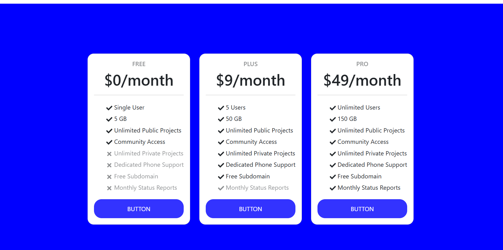

# 💳 Day1task(Pricecard Task)

A simple React-based **Pricing Card UI** built with **Bootstrap** and **React Icons**.  
This project demonstrates reusable components, prop validation, and dynamic rendering of pricing plans.

---

## ✨ Features
- 🎨 Responsive pricing cards using **Bootstrap**
- ⚡ Built with **React + Vite** for fast performance
- 🔄 Dynamic rendering of plans using array mapping
- ✅ Conditional rendering with **FontAwesome icons**
- 🧩 Reusable `Pricecard` component with **PropTypes validation**
- ✨ Hover effects for cards and buttons

---

## 📂 Project Structure
Day1task/
│── public/ # Static assets
│── src/
│ ├── Components/
│ │ └── Pricecard.jsx # Pricecard component
│ ├── App.jsx # Main app file
│ ├── index.css # Custom styles
│ ├── main.jsx # React entry point
│── index.html # Base HTML
│── package.json # Dependencies and scripts
│── vite.config.js # Vite config

---

## 🚀 Getting Started

### 🔹 Clone the repo
```bash
git clone https://github.com/Elanthiran/Day1task.git
cd Day1task
```

---

## 🔹 Install dependencies
```bash
npm install
```

## 🔹 Run the project
```bash
npm run dev
```

## 📌 Usage

1. You will see **3 pricing cards** – **FREE, PLUS, and PRO**.
2. Each card shows:
   - Plan name & monthly price
   - Features list with ✅ (included) or ❌ (not included)
   - Hover effects on the card and button
3. Click the **Button** on any plan to simulate selecting it.

---

## 📸 Screenshots

💻 Desktop View :


📱 Mobile View:


---

## 🛠 Tech Stack

- ⚛️ React (Vite)

- 🎨 Bootstrap 5

- 🎭 React Icons

- 📦 PropTypes

---

## 🔮 Future Improvements

- Add dark mode toggle

- Add animations for hover transitions

- Fetch pricing plans from API / JSON file

- Add payment integration for real usage .

---

## 🤝 Contributing

Contributions are welcome!

- Fork this repo

- Create a new branch (feature-branch)

- Commit changes (git commit -m 'Add feature')

- Push to branch (git push origin feature-branch)

- Open a Pull Request.

---

## 📜 License

This project is licensed under the MIT License.
You are free to use, modify, and distribute this project for personal or commercial purposes.
